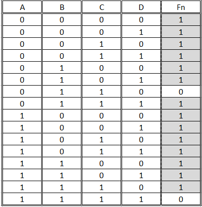
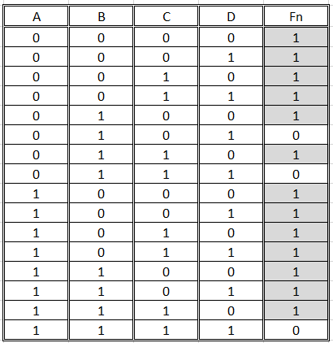

## Logica de Programacion
### Escenario 1

Determina el resultado del diagrama cuando `n = 8`:


### Escenario 2
Identifica los errores en el codigo siguiente:

```java 
 
import java.io.*; 
 
classes GFG {// Las clases deben declararse de forma publica o privada, y no usar prurales
    // Function to print N Fibonacci Number
    stetic void Fibonacci(int N) //Error de sintaxis: static en lugar de stetic y falta declarar si es publico o privado
    {
        int num1 = 0, num2 = 1;
 
        for (int i = 0; i < N; i++) {
            // Print the number
            System.out.print(num1 + " "); //desconozco si es por la sintaxis de java, pero yo identifico como error el hecho de concatenarle un espacio vacio
 
            // Swap
            int num3 = num2 + num1;
            num1 == num2; //igual declarado 2 veces
            num2 = num3;
        }
    }
 
    // Driver Code
    public static vacio main(String args[]) //el compilador no lograra identificar una palabra en español, aun que en ingles este correcto
    {
        // Given Number N
        int N = 10;
 
        // Function Call
        Fibonacci(N, 2); //Aqui se le mandan 2 parametros a la funcion de fibonacci, sin embargo el constructor de fibonacci solo es capar de recibir 1 parametro
    }
}
 

```
## Tablas de verdad
### Escenario

Se te proporcionará una tabla de verdad que describe el comportamiento lógico de una función. Escribe la función booleana simplificada a partir de la tabla (elige cualquiera de las tablas siguientes).





Honestamente desconozco como realizar este ejercicio

### EXTRA 
Representa el circuito lógico que implementa la función booleana simplificada.

## Linux Test

### Escenario
Se te pidio descargar un script y ejecutarlo para corroborar que funciona correctamente. Sin embargo, solo tienes acceso al OS desde la linea de comandos. 

En base al escenario anterior, responde los siguientese ejercicios

### Ejercicios

1. Necesitarás obtener el ejecutable de la url `https://example.com/executables/my_program.sh`. Escribe a continuacion tu script:

curl -o my_program.sh https://example.com/executables/my_program.sh


```bash
# TODO: chmod +x my_program.sh

```
2. El binario funciona correctamente. Tu mision es moverlo para que sea ejecutable globalmente. Guiate en el siguiente diagrama para realizarlo:

```bash
/📂
├── 📂usr 
│   └── 📁local 
│       └── 📁bin # your program should be here
└── 📂home 
    └── 📁 user
        └── 📃 my_program.sh # your program is here
```

```bash
# TODO: sudo mv my_program.sh /usr/local/bin/my_program

	my_program

```
### Puntos extra
3. Explica que acciones realizan los comandos que elegiste en ambos ejercicios

curl:descarga archivos desde una url, la opcion - nos permite especificar el nombre para el archivo

chmod +x: cambia los permisos para hacerlo ejecutable

sudo mv: mueve el archivo descargado a la ruta especificada, que seria /usr/local/bin

my_program: ejecuta el programa desde cualquier parte del sistema para verificar su funcionamiento.

Extra propio: sudo se utiliza para trabajar con permisos de administrador, necesario para modificar directorios o instalar cosas.